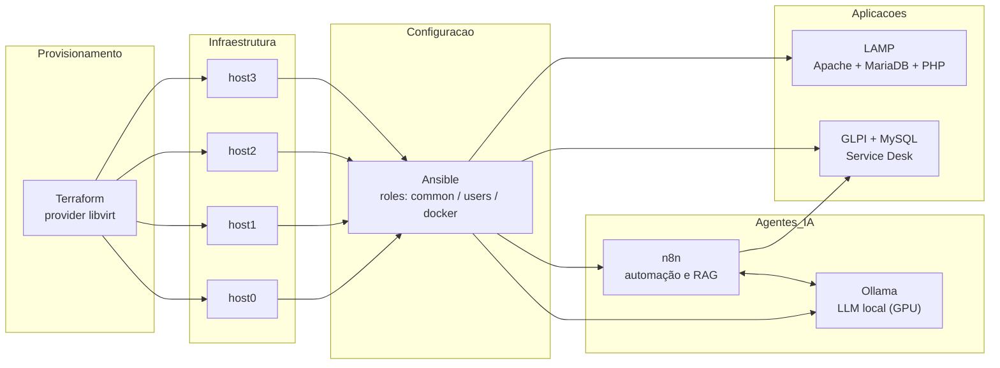

<h1 align="center">🚀 Infrastructure as Code — Laboratórios</h1>

<p align="center">
  Laboratórios práticos de <strong>infraestrutura moderna</strong>: provisionamento com Terraform,
  configuração com Ansible, aplicações em contêineres e agentes de IA aplicados a operações de TI.
</p>

<p align="center">
  
  
  
  
  
  
  
</p>

---

## 🎯 Sobre este repositório

Profissional de TI com experiência sólida em **infraestrutura, administração de servidores Linux/Windows,
redes, virtualização e gestão de TI**, em transição para práticas modernas de **Cloud, IaC, Containers,
DevOps e AIOps**.

Este repositório é o meu laboratório aberto: cada pasta é um experimento reproduzível, do provisionamento
das máquinas virtuais até a camada de aplicação e automação com agentes de IA. O objetivo é mostrar
**como eu penso e construo infraestrutura**, e não apenas o resultado final.

---

## 🧭 Arquitetura do laboratório



---

## 📂 Laboratórios

| Lab | Pasta | O que demonstra |
|---|---|---|
| 🏗️ **Cluster de VMs com Terraform** | [`terraform/libvirt-cluster`](terraform/libvirt-cluster) | Provisionamento declarativo de 4 VMs Debian em KVM/libvirt, pool de storage, rede isolada, cloud-init e uso de módulos |
| ⚙️ **Baseline de servidores com Ansible** | [`ansible`](ansible) | Configuração idempotente pós-provisionamento: pacotes base, Docker, gestão de usuários e chaves SSH, organizado em roles |
| 🐳 **Stack LAMP em contêiner** | [`docker/lamp-stack`](docker/lamp-stack) | Imagem própria (Dockerfile) com Apache, MariaDB, PHP e phpMyAdmin, instalação não interativa via `debconf-set-selections` |
| 🎫 **GLPI Service Desk + IA** | [`docker/glpi-servicedesk`](docker/glpi-servicedesk) | Stack multi-serviço com GLPI, MySQL, phpMyAdmin, n8n e Ollama em rede dedicada, com volumes persistentes |
| 🤖 **Agente RAG no n8n** | [`ai-agents/n8n-rag-agent`](ai-agents/n8n-rag-agent) | Pipeline RAG: Google Drive → extração → chunking → embeddings Mistral → Supabase Vector Store → agente com LLM Groq |
| 💬 **Chatbot n8n + Ollama** | [`ai-agents/n8n-ollama-chatbot`](ai-agents/n8n-ollama-chatbot) | Automação conversacional com LLM local acelerado por GPU NVIDIA |
| 🧠 **Ollama + OpenClaw (stack)** | [`ai-agents/ollama-openclaw-stack`](ai-agents/ollama-openclaw-stack) | Serviços separados de LLM e agente, com volumes nomeados e rede bridge |
| 🧩 **Ollama + OpenClaw (imagem própria)** | [`ai-agents/ollama-openclaw-gpu`](ai-agents/ollama-openclaw-gpu) | Imagem customizada a partir do `ollama/ollama` com reserva de GPU no Compose |

---

## 🛠️ Stack e competências exercitadas

**Infraestrutura como Código** · Terraform (provider libvirt, módulos, variáveis) · Ansible (roles, inventário, idempotência) · cloud-init

**Containers** · Docker · Docker Compose · Dockerfile multi-serviço · volumes e redes nomeadas · reserva de GPU NVIDIA

**Virtualização e Sistemas** · KVM/QEMU/libvirt · Proxmox · Hyper-V · Debian · Windows Server

**Redes e Segurança** · TCP/IP · VLANs · ACLs · firewall · hardening · chaves SSH

**Operações** · Zabbix · backup e restore · troubleshooting · alta disponibilidade · GLPI (service desk)

**AIOps e Automação** · n8n · Ollama · RAG com vector store · LLMs locais e em cloud · Shell Script

---

## ▶️ Como reproduzir

Pré-requisitos gerais: Linux com `git`, Docker e Docker Compose. Para o lab de Terraform, também
`terraform` e `libvirt/KVM`. Para os labs de IA com GPU, drivers NVIDIA e `nvidia-container-toolkit`.

```bash
git clone https://github.com/clebersd/IaC.git
cd IaC
```

Cada pasta tem um `README.md` com os pré-requisitos específicos e os comandos de execução.

---

## ⚠️ Aviso — ambiente de laboratório

Os arquivos deste repositório reproduzem um **laboratório local e isolado**, mantido propositalmente
próximo do que foi executado nos testes. Por isso:

- **As senhas presentes no código são valores de exemplo de laboratório** (ex.: bancos do GLPI, cloud-init
  das VMs e a role de usuários do Ansible) e **não são usadas em nenhum ambiente real**.
- Os IPs do inventário Ansible (`192.168.1.0/24`) são endereços privados da rede do laboratório.
- Em ambiente produtivo, esses valores seriam substituídos por **Ansible Vault**, variáveis de ambiente,
  arquivos `.env` fora do versionamento ou um cofre de segredos (Vault/SOPS/AWS Secrets Manager).

---

## 🗺️ Próximos passos

- [ ] Migrar segredos para Ansible Vault e arquivos `.env`
- [ ] Pipeline de CI para `terraform validate`, `ansible-lint` e `hadolint`
- [ ] Módulos Terraform parametrizados com `for_each` no lugar de hosts fixos
- [ ] Monitoramento do laboratório com Zabbix provisionado via IaC
- [ ] Laboratórios equivalentes em AWS / Azure / GCP

---

## 📬 Contato

**Cleber** — Infraestrutura · Cloud · DevOps · AIOps

[](https://github.com/clebersd)
<!-- Substitua pelo seu perfil antes de publicar -->
[](https://www.linkedin.com/in/SEU-USUARIO)

> 💡 Repositório em evolução contínua. Sugestões e feedback são bem-vindos via *issues*.
