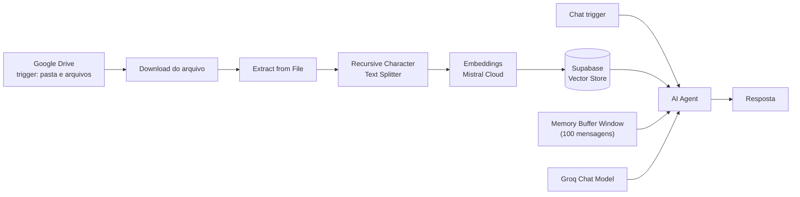

# 🤖 Agente pessoal com RAG no n8n

Agente conversacional com **RAG (Retrieval-Augmented Generation)**: documentos armazenados no Google
Drive são indexados automaticamente em um *vector store* e passam a ser a base de conhecimento
consultada pelo agente no chat.

## 🔄 Pipeline do workflow



**Ingestão:** gatilho no Google Drive → download → extração de texto → *chunking* → embeddings
(Mistral Cloud) → indexação no Supabase Vector Store.

**Consulta:** mensagem no chat → agente combina o contexto recuperado do vector store, a memória de
conversa e o LLM (Groq) para responder.

## 📁 Arquivos

```text
n8n-rag-agent/
├── docker-compose.yml          # Serviço n8n com volume persistente em /home/node/.n8n
└── PersonalAgent_v1.1.json     # Workflow exportado do n8n (versão anonimizada)
```

## ✅ Pré-requisitos

- Docker Engine e Docker Compose v2
- Contas/credenciais: Google Drive, Supabase (com a extensão `pgvector`), Mistral Cloud e Groq

## ▶️ Como executar

```bash
cd ai-agents/n8n-rag-agent

docker compose up -d
# acesse http://localhost:5678
```

Depois, no n8n: **Workflows → Import from File** e selecione `PersonalAgent_v1.1.json`.
As credenciais não acompanham a exportação e precisam ser recriadas em **Credentials**.

## 🧠 O que este lab demonstra

- Arquitetura completa de **RAG**: ingestão, *chunking*, embeddings, vector store e recuperação
- Orquestração de múltiplos provedores de IA (Mistral para embeddings, Groq para inferência)
- Automação orientada a eventos: a base de conhecimento se atualiza sozinha quando o Drive muda
- Persistência do estado do n8n em volume nomeado

## ⚠️ Notas de laboratório

- O workflow foi **anonimizado** antes da publicação — os IDs de credenciais referenciados não são
  utilizáveis e precisam ser substituídos pelos seus.
- Nenhuma chave de API é versionada neste repositório; todas ficam no cofre de credenciais do n8n.

## 🔭 Evoluções previstas

- Reexportar o JSON do workflow a partir do n8n para garantir integridade do arquivo
- Substituir o LLM em cloud por Ollama local (ver [`ollama-openclaw-gpu`](../ollama-openclaw-gpu))
- Avaliação de qualidade das respostas e ajuste de tamanho de chunk
